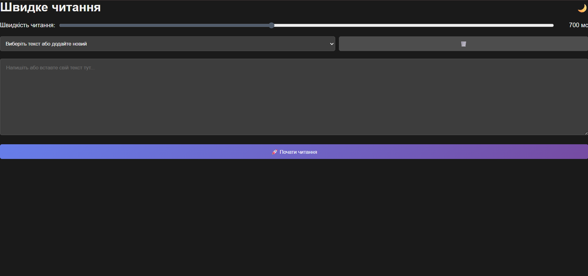

# 📖 TextReader


читання текстів з підтримкою темної та світлої теми.

## ✨ Особливості

- 🌙 **Темна/світла тема** - зручне читання в будь-який час доби
- 📚 **Локальна база текстів** - зберігайте свої улюблені твори
- ⚡ **Швидкий сервер** - на Node.js з Express
- 📱 **Адаптивний дизайн** - працює на комп'ютері та телефоні
- 💾 **Автозбереження** - продовжуйте з того місця, де зупинились

## 🚀 Швидкий старт

### Встановлення
```bash
git clone https://github.com/Svjatoslav22/textsRader.git

cd textsRader

npm install
Запуск
bash
npm run dev

npm start
Відкрийте в браузері
text
http://localhost:3000

dashboard:
https://textsrader.onrender.com/